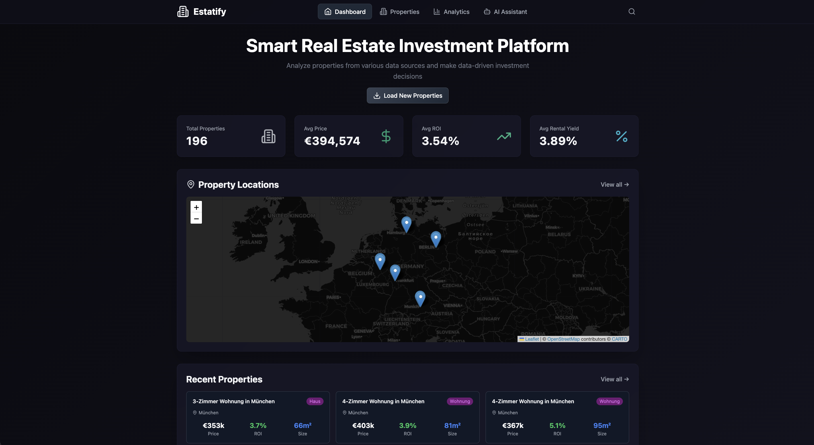

# Estatify - Smart Real Estate Investment Platform

A modern, AI-powered real estate investment platform that helps you analyze properties, make data-driven investment decisions, and track market trends across multiple German cities.



## 📋 Table of Contents

- [Features](#features)
- [Tech Stack](#tech-stack)
- [Installation](#installation)
- [Getting Started](#getting-started)
- [Application Overview](#application-overview)
- [API Configuration](#api-configuration)
- [Project Structure](#project-structure)
- [Contributing](#contributing)

## ✨ Features

- **Dashboard Overview**: Real-time statistics and interactive property map
- **Property Management**: Browse, filter, and analyze real estate listings
- **Market Analytics**: Comprehensive market analysis with interactive charts
- **AI Assistant**: Get personalized investment recommendations powered by AI
- **ROI Calculator**: Detailed financial projections and return calculations
- **Financing Tools**: Calculate monthly payments and cashflow scenarios
- **Interactive Maps**: Visualize property locations across Germany

## 🛠 Tech Stack

**Frontend:**
- React 18 with React Router
- Tailwind CSS for styling
- Recharts for data visualization
- Leaflet for interactive maps
- Lucide React for icons

**Backend:**
- Node.js with Express
- SQLite database (better-sqlite3)
- OpenAI API for AI features
- Axios for HTTP requests

## 📦 Installation

### Prerequisites

- Node.js (v18 or higher)
- pnpm package manager (recommended) or npm

### Setup Steps

1. **Clone the repository**
   ```bash
   git clone https://github.com/yourusername/estatify.git
   cd estatify
   ```

2. **Install dependencies**
   ```bash
   pnpm install
   # or
   npm install
   ```

3. **Environment Configuration**
   
   Create a `.env` file in the root directory:
   ```env
   OPENAI_API_KEY=your_openai_api_key_here
   PORT=5173
   ```

4. **Initialize the database**
   
   The SQLite database (`estatify.db`) will be automatically created on first run.

## 🚀 Getting Started

### Development Mode

Run both the frontend and backend concurrently:

```bash
pnpm run dev
```

This will start:
- Frontend server on `http://localhost:5173`
- Backend server on `http://localhost:5173` (proxy configured)

### Alternative Commands

**Run backend only:**
```bash
pnpm run server
```

**Run frontend only:**
```bash
pnpm run client
```

**Build for production:**
```bash
pnpm run build
```

**Preview production build:**
```bash
pnpm run preview
```

## 📱 Application Overview

### 1. Dashboard - Main Overview


The **Dashboard** is your central hub for real estate investment insights:

- **Key Statistics Cards**:
  - Total Properties: Overview of all available listings
  - Average Price: Market price trends
  - Average ROI: Return on Investment metrics
  - Average Rental Yield: Expected rental returns

- **Interactive Property Map**: Visualize all properties on a map with markers showing exact locations across Germany

- **Recent Properties**: Quick access to the latest property listings with key metrics (price, ROI, size)

- **Load New Properties Button**: Fetch fresh property data from various sources

### 2. Properties - Detailed Listings


The **Properties** page offers comprehensive property browsing:

- **Advanced Filters**:
  - Filter by city, price range, minimum ROI, and property type
  - Apply and reset filters easily
  - Real-time results counter

- **Property Cards** showing:
  - High-quality property images
  - Location and address
  - Price, ROI percentage, and size
  - Rental yield and price per square meter
  - Property type badges (Haus/Wohnung)

- **Hover Effects**: Cards feature smooth animations and scale effects for better user experience

### 3. Analytics - Market Insights


The **Analytics** dashboard provides deep market intelligence:

- **Summary Statistics**:
  - Total properties in database
  - Average price across all listings
  - Average ROI and rental yield

- **Interactive Charts**:
  - **Average Prices by City**: Bar chart comparing prices across major German cities
  - **ROI Distribution**: Pie chart showing ROI ranges (0-3%, 3-5%, 5-7%)
  - **Property Types**: Distribution of houses vs. apartments
  - **City Comparison**: Line chart tracking ROI performance by location

- **Price Distribution**: Visual breakdown of properties by price ranges

- **Top Cities**: Quick view of cities with the most listings (Köln, Frankfurt, Berlin, Hamburg, München)

### 4. Property Details - In-Depth Analysis


Each property has a dedicated detail page featuring:

- **Property Header**:
  - Full title and address
  - Total price and price per square meter
  - High-resolution property image

- **Key Metrics Grid**:
  - Living space, number of rooms
  - ROI and rental yield percentages
  - Estimated monthly rent
  - Property type, year built, condition

- **ROI Calculation Breakdown**:
  - Annual rental income
  - Purchase costs (Nebenkosten)
  - Total investment required
  - Annual operating expenses
  - Net annual income
  - Detailed ROI formula explanation

- **Financing Calculator**:
  - Adjustable down payment slider (10-100%)
  - Interest rate input
  - Loan term selection (5-40 years)
  - **Live calculations**:
    - Monthly payment amount
    - Monthly cashflow (rent - payment - costs)
    - Total loan amount
    - Total amount paid over loan term

- **Future Projections (10 Years)**:
  - Year-by-year property value appreciation (3% annual)
  - Rental income growth (2% annual)
  - Equity buildup
  - Total return calculations
  - Final 10-year total return summary

- **Interactive Map**: Property location with zoom capabilities

### 5. AI Assistant - Personalized Recommendations


The **AI Assistant** provides intelligent investment guidance:

- **Chat Interface**:
  - Natural language conversations about real estate investment
  - Assistance with property valuations, ROI analyses, location recommendations
  - Market trend insights and risk assessment

- **Quick Question Buttons** for common queries:
  - "Which property has the best ROI?"
  - "Which city should I invest in?"
  - "What are the risks with high property prices?"
  - "How do I calculate rental yield?"

- **AI Recommendations Panel**:
  - Personalized property suggestions based on your criteria
  - Investment scores (0-100) for each recommendation
  - Key metrics: Price, ROI, size
  - Reasoning behind each recommendation
  - Real-time market data integration

- **Investment Tips Section**:
  - Best practices for portfolio diversification
  - Minimum ROI recommendations
  - Long-term market trend considerations
  - Infrastructure and location factors

## 🔧 API Configuration

### OpenAI Integration

The platform uses OpenAI's API for:
- Personalized property recommendations
- Investment risk analysis
- Natural language chat interface
- Market trend insights

Make sure to add your OpenAI API key to the `.env` file.

### Data Sources

Properties are aggregated from multiple sources (configurable in `server/services/scrapers.js`):
- ImmobilienScout24
- Immowelt
- Custom data feeds

## 📂 Project Structure

```
estatify/
├── server/                 # Backend server
│   ├── index.js           # Express server setup
│   ├── routes/            # API routes
│   │   ├── properties.js  # Property endpoints
│   │   ├── analytics.js   # Analytics endpoints
│   │   └── ai.js          # AI assistant endpoints
│   ├── services/          # Business logic
│   │   └── scrapers.js    # Property data scrapers
│   └── utils/             # Helper functions
│       └── calculations.js # ROI calculations
├── src/                   # Frontend application
│   ├── components/        # React components
│   │   ├── Layout.jsx     # Main layout
│   │   ├── PropertyMap.jsx
│   │   ├── StatCard.jsx
│   │   └── RecentProperties.jsx
│   ├── pages/             # Page components
│   │   ├── Dashboard.jsx
│   │   ├── Properties.jsx
│   │   ├── PropertyDetail.jsx
│   │   ├── Analytics.jsx
│   │   └── AIAssistant.jsx
│   ├── App.jsx            # Main app component
│   ├── main.jsx           # Entry point
│   └── index.css          # Global styles
├── screenshots/           # Application screenshots
├── estatify.db           # SQLite database
├── package.json          # Dependencies
├── vite.config.js        # Vite configuration
├── tailwind.config.js    # Tailwind CSS config
└── README.md             # This file
```

## 🎨 Design Features

- **Dark Theme**: Professional dark color scheme optimized for extended use
- **Responsive Design**: Fully responsive layout that works on desktop, tablet, and mobile
- **Smooth Animations**: Subtle hover effects and transitions throughout
- **Glassmorphism**: Modern glass-effect cards with backdrop blur
- **Accessibility**: High contrast ratios and semantic HTML

## 🔐 Security Notes

- Never commit your `.env` file with API keys
- Keep your OpenAI API key secure
- The SQLite database is included for development; use a proper database in production
- Implement rate limiting for production API endpoints

## 🚧 Roadmap

- [ ] User authentication and personal portfolios
- [ ] Email notifications for new properties matching criteria
- [ ] Property comparison tool
- [ ] Export reports to PDF
- [ ] Mobile app (React Native)
- [ ] Integration with more property data sources
- [ ] Advanced AI market predictions
- [ ] Multi-currency support

## 📄 License

This project is licensed under the MIT License - see the LICENSE file for details.

## 👥 Contributing

Contributions are welcome! Please feel free to submit a Pull Request.

1. Fork the project
2. Create your feature branch (`git checkout -b feature/AmazingFeature`)
3. Commit your changes (`git commit -m 'Add some AmazingFeature'`)
4. Push to the branch (`git push origin feature/AmazingFeature`)
5. Open a Pull Request

## 📧 Support

For support, please open an issue in the GitHub repository or contact the development team.

---

**Built with ❤️ for smart real estate investors**
